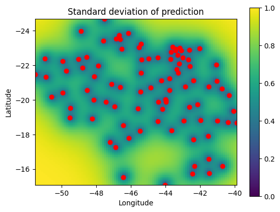

# Gaussian-Process

### Modeling temperature data with Gaussian processes

This project explores the modeling of geospatial data via Gaussian processes. Each row in gptrain.csv and gptest.csv corresponds to a temperature reading at a given weather station in Brazil at 2 pm on January 1, 2021. The first column gives the latitude of the station, the second the longitude, and the final column is the temperature reading in degrees Celsius. The goal is to fit a simple Gaussian Process model on gptrain.csv and use it to infer temperatures at other locations at that same date and time.

The Gaussian process has the co-variance function 

$$k(x, x') = exp \left(\frac{-||x-x'||}{\sigma}\right)$$

and mean function m(x) = 20 (degrees Celsius). Here ||x − x'|| denotes Euclidean distance between raw latitude and longitude coordinates.

The locations in gptrain.csv are denoted by $X_{tr}$ and the temperatures at those locations are denoted by $y_{tr}$; $X_{te}$, $y_{te}$ are defined analogously for gptest.csv. Thus $X_{tr}$ is a 93 × 2 matrix while $y_{tr}$ is a 93-dimensional vector.

The joint distribution of training and test responses can be written as

$$\begin{pmatrix} 
  y_{tr}\\
  y_{te} 
\end{pmatrix} \sim N \left( \begin{bmatrix}
20 \\
\vdots \\
20
\end{bmatrix}, \begin{bmatrix}
K_{tr} & K_{tr,te} \\ 
K_{te,tr} & K_{te} 
\end{bmatrix} \right)$$

where the block matrix 

$$\begin{bmatrix}
K_{tr} & K_{tr,te} \\ 
K_{te,tr} & K_{te} 
\end{bmatrix}$$

is the matrix arising from all pairwise evaluations of the covariance function k(·) over all training and testing locations, and its diagonal components $K_{tr}$ and $K_{te}$ are the matrices arising from all pairwise covariances within the training and test sets, respectively. Using properties of the Gaussian, it can be shown that the distribution of test responses given training locations, training responses, and test locations, follows

$$ (y_{te} | y_{tr}, X_{te}, X_{tr}) \sim m_{te} + N( K_{te,tr} \cdot K_{tr}^{−1} (y_{tr} − m_{te}),\ K_{te} − K_{te,tr} K_{tr}^{−1} K_{tr,te} ) $$

In Bayesian language, this is the posterior predictive distribution. The diagonal of the posterior predictive matrix $K_{te} − K_{te,tr}K_{tr}^{−1} K_{tr,te}$ gives the conditional variances of the test responses given $X_{tr}$, $X_{te}$, and $y_{tr}$.

### Predictions

Following is a plot showing the predicted (posterior mean) temperature at all points in a rich grid of test latitudes and longitudes within the range found in the training set. 

The plot below shows the standard deviation of the prediction at all points in the grid along with the locations of the stations (red circles) found in the training set.

It can be observed from the plot above that predictions at points closer to the training points have low standard deviation and predictions at points far from the training points have high standard deviation. This implies that standard deviation increases as the distance from training points increases.
